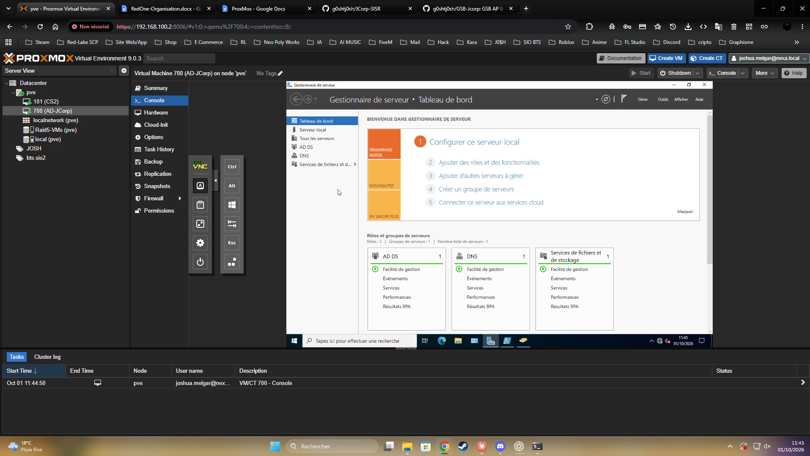
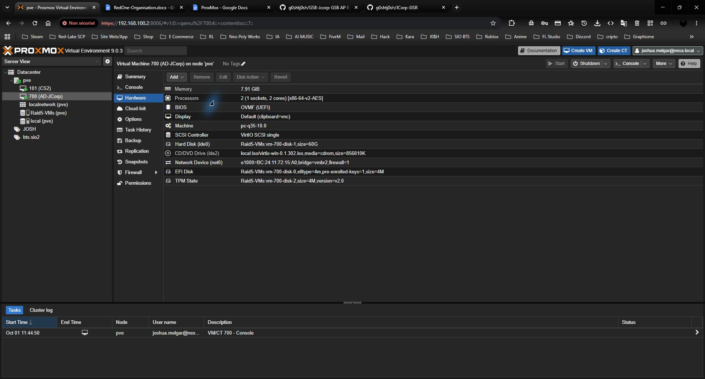
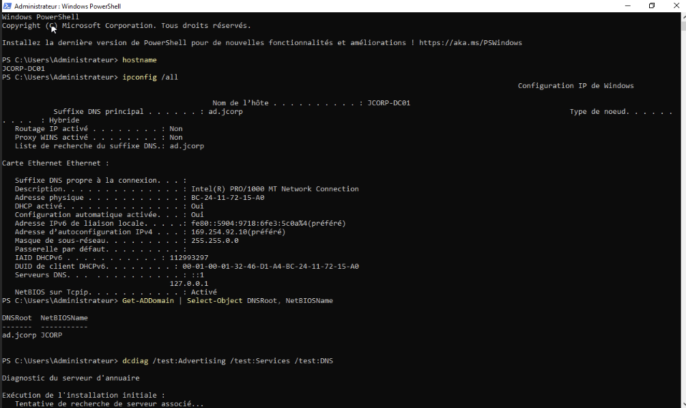
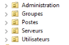
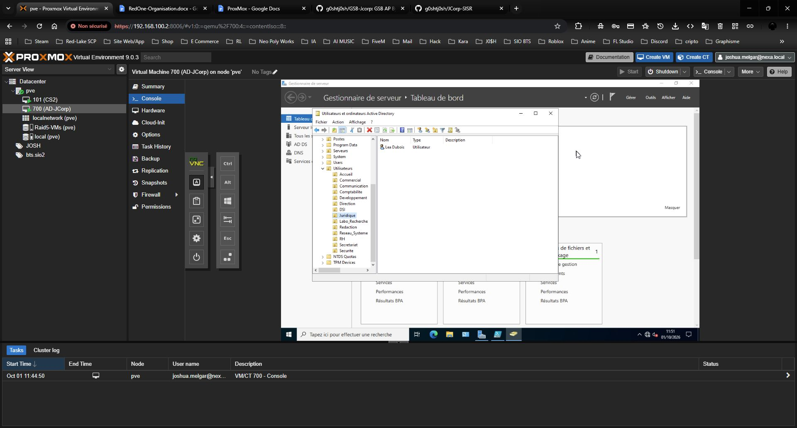
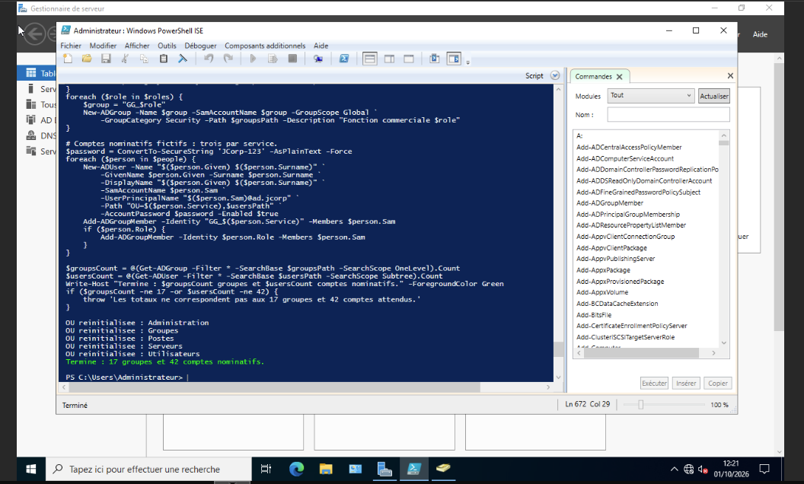
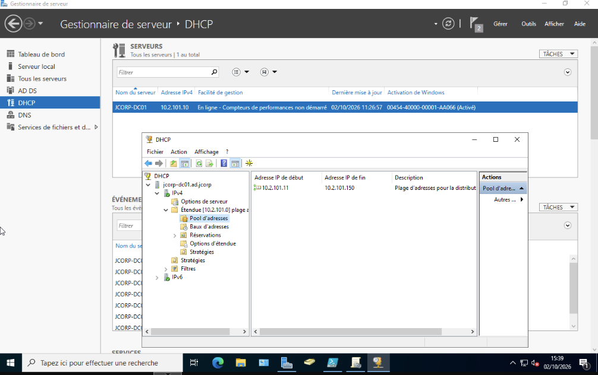
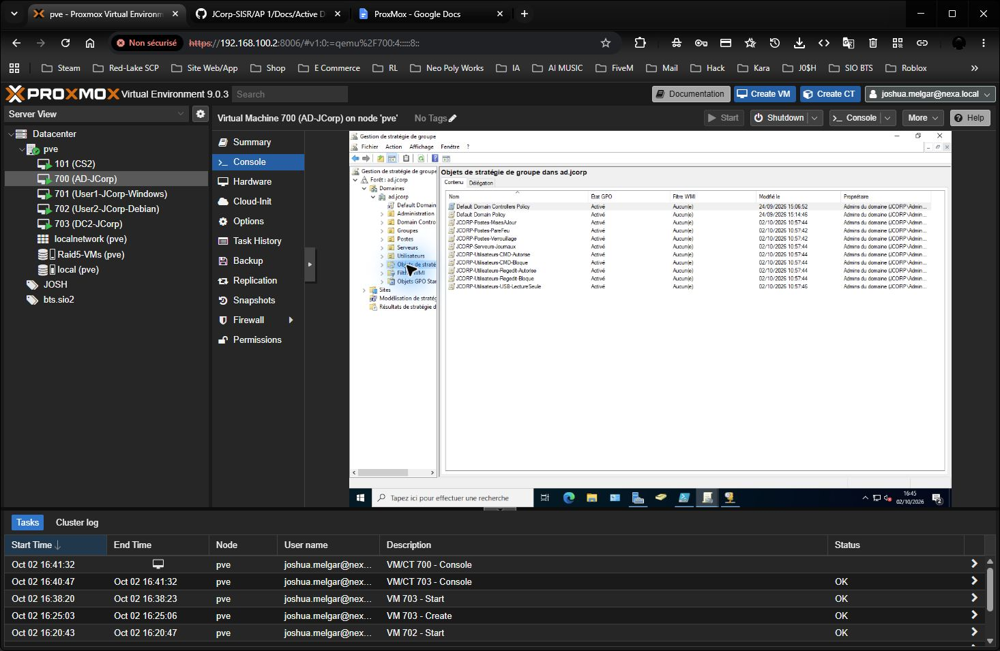

# Active Directory, GPO, DHCP et contrôleurs de domaine - AP 1 JCorp

Je présente ici l'installation de mon premier contrôleur de domaine JCorp, la configuration DHCP et les GPO, avec les captures prises dans mon infrastructure.

## 1. Créer la machine virtuelle

J'ai créé mon serveur AD sur Proxmox avec le **VMID 700**. Sa carte réseau utilise le pont `vmbr2` avec le tag **VLAN 700**. La première capture montre la VM et le Gestionnaire de serveur Windows ; la seconde montre les paramètres matériels avant l'ajout du tag VLAN.





Je n'ai pas conservé de capture des écrans de création de la VM ni de l'installation initiale de Windows.

## 2. Fixer le nom et l'adresse du serveur

J'ai nommé le serveur Windows **`JCORP-DC01`** et configuré l'adresse **`10.2.101.10/24`**. Son DNS préféré pointe vers son propre service DNS. J'ai renseigné **`10.2.101.1`** comme passerelle, selon les indications de mon administrateur réseau. Lors du premier diagnostic, le serveur utilisait encore une adresse automatique `169.254.x.x`, ce qui empêchait la résolution du domaine. J'ai configuré l'adresse fixe, actualisé les enregistrements DNS et relancé les diagnostics avec succès. Après l'ajout du tag VLAN 700, le ping de la passerelle répond avec **0 % de perte**.

| Paramètre | Valeur constatée |
| --- | --- |
| Nom Windows | `JCORP-DC01` |
| Adresse IPv4 | `10.2.101.10` |
| Masque | `255.255.255.0` |
| DNS du serveur | `10.2.101.10` ou boucle locale selon la configuration du contrôleur |
| Passerelle | `10.2.101.1` |

## 3. Installer AD DS et DNS, puis créer le domaine

J'ai installé les rôles **Services de domaine Active Directory (AD DS)** et **DNS** depuis le Gestionnaire de serveur, puis promu le serveur comme premier contrôleur de la forêt **`ad.jcorp`**. Le nom court NetBIOS est **`JCORP`**.

La sortie ci-dessous confirme le nom du serveur et le domaine. J'ai corrigé l'adresse IP après ce premier contrôle.



Après la correction réseau, les contrôles `dcdiag` des services et du DNS ont réussi.

Je prépare également la VM Proxmox **703**, nommée `DC2-JCorp`, pour ajouter un second contrôleur au domaine existant. Sa promotion et la réplication AD seront documentées après leur réalisation.

## 4. Organiser les unités d'organisation et les groupes

J'ai placé les cinq OU principales **directement sous `ad.jcorp`** : `Administration`, `Groupes`, `Postes`, `Serveurs` et `Utilisateurs`. Les OU des services se trouvent dans `Utilisateurs`. Le contrôleur de domaine reste dans l'OU système `Domain Controllers`.



Dans la console Active Directory, on voit les OU des services sous `Utilisateurs` et le compte Léa Dubois dans `Juridique`.



J'ai créé **17 groupes globaux de sécurité** : un par service et trois pour les fonctions commerciales (visiteur médical, délégué régional et responsable de secteur). La capture suivante montre le résultat de cette première exécution.



J'ai aussi préparé une [version actualisée du script](JCORP-Reset-AD.ps1) pour créer **trois comptes aux noms inventés par service**, soit 42 comptes, et les ajouter aux groupes correspondants. Les trois comptes commerciaux reçoivent également leur groupe de fonction. Le script contrôle les objets présents avant de recréer la structure et demande le mot de passe au lancement.

| Type d'objet | Prévu par le script actualisé |
| --- | ---: |
| OU principales | 5 |
| OU de service | 14 |
| Groupes de sécurité | 17 |
| Comptes nominatifs fictifs | 42 |

J'utilise ces groupes pour cibler les GPO. Ils serviront aussi aux droits sur les partages et les applications. Aucun mot de passe n'est publié dans ce dépôt.

## 5. DHCP sur JCORP-DC01

J'ai ajouté le rôle **DHCP** sur `JCORP-DC01`. Dans la console, l'étendue IPv4 du réseau `10.2.101.0/24` et son pool d'adresses de **`10.2.101.11` à `10.2.101.150`** sont visibles. Cette capture montre la plage configurée, pas un bail reçu par un poste client.



## 6. Stratégies de groupe

J'ai préparé et utilisé le [script de création des GPO](../GPO/JCORP-GPO.ps1) pour les relier aux OU `Postes`, `Serveurs` et `Utilisateurs`. Avant de créer quoi que ce soit, il vérifie le domaine `ad.jcorp`, ces trois OU et les groupes nécessaires. Je peux le relancer sans multiplier les GPO ni les liens.

Depuis Windows PowerShell 5.1, avec un compte administrateur du domaine, j'utilise :

```powershell
.\JCORP-GPO.ps1 -WhatIf
.\JCORP-GPO.ps1
```

| Cible | Règles créées |
| --- | --- |
| Postes | Verrouillage après 10 minutes, pare-feu Windows, mises à jour automatiques à 03:00 |
| Serveurs placés dans `OU=Serveurs` | Taille des journaux Windows portée à 64 Mio |
| Utilisateurs | CMD et Regedit bloqués par défaut |
| `GG_DSI` | CMD et Regedit autorisés par des GPO d'exception prioritaires |
| `GG_Developpement` | CMD autorisé par une GPO d'exception prioritaire |
| `GG_RH`, `GG_Comptabilite`, `GG_Juridique`, `GG_Direction` | Lecture des supports USB autorisée, écriture bloquée |

Les exceptions reposent sur les groupes AD : le script ne cible pas des personnes par leur nom. Le contrôleur de domaine `JCORP-DC01` reste dans l'OU système `Domain Controllers`, donc la GPO liée à `OU=Serveurs` ne s'applique pas à lui.

Dans la console **Gestion de stratégie de groupe**, je vois les neuf GPO `JCORP-*` créées dans `ad.jcorp` : trois pour les postes, une pour les serveurs et cinq pour les utilisateurs. Cette capture prouve leur présence dans le domaine. Je testerai leur application sur le poste Windows 11 après sa jonction au domaine.



La configuration **Windows LAPS** est facultative : `-ConfigureLaps` crée sa GPO uniquement si le schéma Windows LAPS existe déjà. Je dois d'abord préparer les droits d'écriture des ordinateurs et les droits de lecture des mots de passe pour les administrateurs habilités. Le script ne modifie pas le schéma AD.

Je n'ai pas créé de GPO de lecteurs réseau, car les chemins des futurs partages ne sont pas encore définis. Les GPO limitant les réglages Windows, bloquant les macros Office venant d'Internet ou limitant de manière générale les logiciels ne font pas partie de ce script.

Les GPO de postes s'appliqueront après la jonction d'un poste à `ad.jcorp` et son placement dans `OU=Postes`. Sur ce poste, je pourrai lancer `gpupdate /force` puis `gpresult /r` pour contrôler les règles reçues. Les stratégies de mots de passe du domaine se configurent au niveau du domaine, et non dans l'OU `Utilisateurs`.

Pour afficher la liste réelle des GPO créées sur le domaine depuis Windows PowerShell, j'utilise :

```powershell
Import-Module GroupPolicy
Get-GPO -All -Domain ad.jcorp | Where-Object DisplayName -like 'JCORP-*' | Sort-Object DisplayName | Select-Object DisplayName, Id
```

## 7. Vérifications à conserver

J'utilise les commandes suivantes sur le contrôleur de domaine pour contrôler le nom du serveur, le réseau, le domaine et l'annuaire :

```powershell
hostname
ipconfig /all
Get-ADDomain | Select-Object DNSRoot, NetBIOSName
dcdiag /test:Advertising /test:Services /test:DNS
```

La prochaine étape est la jonction de la VM Windows 11 au domaine, puis le test de connexion d'un utilisateur et de l'application des GPO avec `gpresult /r`.

